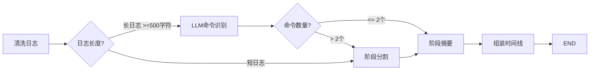
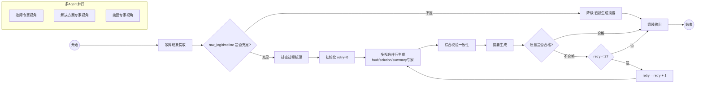
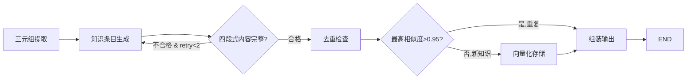
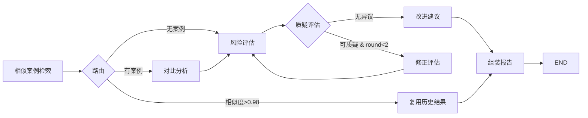

# 🔧 轻量化售后工单系统

> 基于 **FastAPI + LangGraph + Vue3 + LLM** 的智能售后工单管理平台  
> 围绕「自动采集 → 智能分析 → 知识沉淀」三条主线，实现售后全流程数字化

[](https://www.python.org/)
[](https://fastapi.tiangolo.com/)
[](https://vuejs.org/)
[](https://langchain-ai.github.io/langgraph/)
[](https://tongyi.aliyun.com/)

---

## 📖 目录

- [项目意义](#项目意义)
- [系统架构](#系统架构)
- [功能模块](#功能模块)
- [🤖 Agent 智能体](#-agent-智能体)
- [技术栈](#技术栈)
- [快速开始](#快速开始)
- [项目结构](#项目结构)
- [API 一览](#api-一览)
- [开发计划](#开发计划)

---

## 项目意义

### 痛点

传统售后工单模式完全依赖人工记录，存在五大核心痛点：

| 痛点 | 表现 |
|------|------|
| **效率低** | 工程师处理完故障后需重新整理排查过程、命令、日志，手工填写工单耗时费力 |
| **质量差** | 不同工程师记录习惯差异大，格式混乱、详略不一、关键步骤遗漏 |
| **知识流失** | SSH 操作、日志分析、故障定位思路等关键技术经验无法结构化留存 |
| **统计难** | 缺乏统一数据分析能力，管理层无法基于数据决策 |
| **配合度低** | 工程师抵触重复性文书工作，敷衍填写，工单质量失控 |

### 解决方案

本项目通过 **AI Agent 智能体** 实现售后业务由「人工记录」向「自动采集、智能生成、知识沉淀」的转变：

```
客户报障 → 工程师远程处理 → 自动采集操作数据 → 🤖 Agent 智能分析
    → 自动生成标准工单 → 工程师审核确认 → 知识库沉淀 → 历史经验复用
```

### 核心价值

- ⚡ **效率提升 80%**：工程师只需粘贴终端日志，Agent 自动完成工单填写
- 📋 **质量统一**：AI 生成标准化工单，格式一致、内容完整
- 🧠 **知识资产化**：故障经验自动向量化存储，可检索、可复用
- 📊 **数据可量化**：完整的统计分析与可视化报表

---

## 系统架构

```
                         ┌──────────────────────────┐
                         │     Vue3 + Element Plus   │
                         │       前端管理界面         │
                         └─────────────┬────────────┘
                                       │ HTTP/WS
                         ┌─────────────▼──────────────┐
                         │     FastAPI 主业务服务       │
                         │  工单│客户│报表│权限│Agent调度│
                         └──────┬─────────────┬───────┘
                                │ REST API    │
                    ┌───────────▼───┐   ┌─────▼──────────┐
                    │ Flask Agent   │   │   数据库/缓存    │
                    │ 微服务         │   │                │
                    │               │   │  PostgreSQL     │
                    │ ┌───────────┐ │   │  Redis          │
                    │ │ LangGraph  │ │   │  Chroma (向量)  │
                    │ │ 工作流引擎  │ │   └────────────────┘
                    │ └─────┬─────┘ │
                    │       │       │
                    │ ┌─────▼─────┐ │
                    │ │   LLM     │ │
                    │ │ 百炼 Qwen  │ │
                    │ └───────────┘ │
                    └───────────────┘
```

**设计原则**：前后端分离 + AI 服务解耦，业务逻辑与 AI 推理独立部署，便于升级和扩容。

---

## 功能模块

### 🌐 Web 管理界面（7 个页面）

| 页面 | 功能 |
|------|------|
| **登录** | JWT 认证，默认账号 admin/admin123 |
| **工作台** | 待办/进行中/已完成统计卡片 + 快速创建工单 |
| **工单中心** | 列表（筛选/分页）+ 详情（信息/时间线/状态流转/Agent 操作区） |
| **客户管理** | 客户 CRUD + 搜索（学校/单位信息维护） |
| **报表中心** | ECharts 图表（饼图/柱状图/折线图）+ 工作量排名 + Excel 导出 |
| **知识库** | 知识条目列表 + 关键词/语义检索 + 四段式详情（问题→原因→现象→方案）+ Excel 导出 |
| **工单详情** | 全生命周期管理 + 🤖 AI 按钮（解析生成/排查建议/提取知识） |

### ⚙️ 后端业务（FastAPI）

- 用户认证（JWT + 密码哈希）
- 工单 CRUD + 状态机流转（新建→处理中→待确认→已完成→已归档）
- 客户管理
- RBAC 权限控制
- 报表统计 + Excel 导出
- Agent 服务调度

---

## 🤖 Agent 智能体

Agent 是本系统的核心智能能力，采用 **Flask 微服务 + LangGraph 工作流 + 百炼 Qwen-Plus** 独立部署，通过 REST API 提供智能分析。

### Agent 总览

| # | Agent | LangGraph 图 | 接口 | 触发按钮 | 调用时机 |
|---|-------|:---:|------|---------|---------|
| ① | 日志解析 | ✅ parse | `POST /agent/log/parse` | 🤖 AI解析并生成工单 (Step1) | 粘贴日志后，手动触发 |
| ② | 工单生成 | ✅ generate | `POST /agent/ticket/generate` | 🤖 AI解析并生成工单 (Step2) | 日志解析完成后，自动串联 |
| ③ | 知识提取 | ✅ knowledge | `POST /agent/knowledge/extract` | 📚 提取知识 | 工单完成后 (status≥4) |
| ④ | 相似检索 | ❌ 函数调用 | `POST /agent/search` | 知识库搜索框 | 任意时刻手动搜索 |
| ⑤ | 故障分析 | ✅ analyze | `POST /agent/fault/analyze` | 📊 深度分析 | 待确认/已完成 (status≥3) |
| ⑥ | 排查建议 | ❌ 函数调用 | `POST /agent/ticket/suggest` | 🔍 智能排查建议 | 工单新建后，**仅限一次** |

### 工单生命周期中的 Agent 调用顺序

```
创建工单 → ⑥ 排查建议 → 工程师操作 → 粘贴日志 → ① 日志解析 → ② 工单生成
    → 工程师审核修正（待确认状态可编辑AI内容） → ⑤ 故障分析 → 确认完成
    → ③ 知识提取 → 归档

    ④ 相似检索 是随时可用的独立功能，不参与工单流转
```

---

### Agent ①：日志解析（process_recorder）

> `POST /agent/log/parse` — 将 SSH/堡垒机终端日志转为结构化时间线

**LangGraph 工作流**（`parse_graph.py`，5 节点 + 2 条件分支）：



**LangGraph 特性**：`add_conditional_edges` × 2 — 短日志跳过 LLM 节省 token，少命令跳过分段

**输入**：原始终端日志文本

**输出示例**：

```json
{
  "timeline": [
    {
      "step": 1, "phase": "环境检查", "operation": "检查 Nginx 服务状态",
      "command": "systemctl status nginx",
      "summary": "发现 nginx.service 处于 inactive (dead) 状态", "result": "服务未运行"
    }
  ],
  "phase_count": 6, "total_steps": 10, "duration_ms": 15600
}
```

---

### Agent ②：工单生成（ticket_generator）⭐ 最核心

> `POST /agent/ticket/generate` — 汇总售后数据，多视角并行生成标准工单

**LangGraph 工作流**（`generate_graph.py`，7 节点 + 3 条件分支 + 并行执行）：




**LangGraph 特性**：

- `add_conditional_edges` — 数据不足时降级，跳过 LLM 排查/根因/方案
- **循环**（`retry<2`）— 摘要质量不合格时回退到并行生成节点重试
- **多 Agent 并行**（`ThreadPoolExecutor`）— 3 个 LLM specialist 同时调用故障/方案/摘要视角，synthesizer 综合校验一致性

**输出**：标准 5 段工单 JSON（同旧版）

---

### Agent ③：知识提取（knowledge_extractor）

> `POST /agent/knowledge/extract` — 从已完成工单提取知识条目，向量化存储

**LangGraph 工作流**（`knowledge_graph.py`，6 节点 + 2 条件分支 + 循环）：



**LangGraph 特性**：
- `add_conditional_edges` × 2 — 质量校验 + 去重路由
- **循环**（`retry<2`）— 知识条目内容不完整时回退重试
- 四段式知识结构：问题描述 → 根因 → 现象 → 解决方案

**Embedding**：1024 维向量，基于百炼 `text-embedding-v3`

---

### Agent ④：相似检索（ticket_search）

> `POST /agent/search` — 输入故障描述，返回 Top-K 相似历史知识

无 LangGraph 图，直接调用 `search_similar()` 函数查询 ChromaDB。

```
查询: "Nginx 502 端口占用"
  → [0.792] Nginx端口冲突致502错误
  → [0.728] nginx端口占用导致502错误
  → [0.000] 数据库连接池泄露处理 (不相关)
```

> 注意：Agent ⑤ 和 ⑥ 内部也共用同一个 `search_similar()` 底层函数做相似检索，但检索结果作为 LLM 推理的中间输入，不直接展示给用户。

---

### Agent ⑤：故障分析（fault_analyzer）

> `POST /agent/fault/analyze` — 深度分析工单，评估风险，提出改进建议

**LangGraph 工作流**（`analyze_graph.py`，7 节点 + 3 条件分支 + 辩论循环）：



**LangGraph 特性**：
- `add_conditional_edges` — 3 路路由：已知问题直接复用 / 有案例对比 / 无案例跳过
- **辩论循环**（`round<2`）— challenger（审计员视角质疑）→ defender（修正评估）→ 回到风险评估，最多 2 轮
- **动态终止** — 相似度 > 0.98 时跳过全部 LLM 节点直接复用

**分析维度**：严重程度 | 复发风险 | 影响版本 | 风险详情 | 预防措施 | 长期优化建议 | 相似案例引用

---

### Agent ⑥：排查建议（ticket_suggester）

> `POST /agent/ticket/suggest` — 根据模糊问题描述，检索相似案例 + LLM 推理，生成排查建议

无 LangGraph 图，单次 LLM 调用 + 相似检索前置。


**设计原则**：建议仅供工程师排查参考，写入时间线（`node_type="Agent建议"`）但不记入 `raw_log`，确保工单事实数据不被 AI 推测污染。同一工单限生成一次。

---

### 前端完整操作区

工单详情页右侧 **「🤖 Agent 智能分析」** 卡片内集中所有 Agent 入口：

| 工单状态 | 可见按钮 | 调用的 Agent |
|---------|---------|------------|
| 新建(1) | 🔍 智能排查建议 | ⑥ |
| 处理中(2) | 🤖 AI解析并生成工单 (顶部) | ①→② |
| **待确认(3)** | ✏️ **修正AI内容** / 💾 保存修改 / 📊 深度分析 | ②编辑 / ⑤ |
| 已完成(4) | 📊 深度分析 / 📚 提取知识 | ⑤ / ③ |
| 已归档(5) | 📊 深度分析 | ⑤ |

> **待确认状态**：AI 生成的四段内容（故障现象/根因分析/解决方案/AI摘要）切换为 `<el-input type="textarea">` 可编辑模式，工程师修正后保存再确认完成。

---

### 四个 LangGraph 图特性总览

| 特性 | parse (①) | generate (②) | knowledge (③) | analyze (⑤) |
|------|:---:|:---:|:---:|:---:|
| 条件分支 | ✅ | ✅ | ✅ | ✅ |
| 循环/重试 | — | ✅ | ✅ | ✅ |
| 多 Agent 并行 | — | ✅ | — | — |
| 动态终止 | ✅ | ✅ | ✅ | ✅ |
| 多 Agent 辩论 | — | — | — | ✅ |
| 节点数 | 5 | 7 | 6 | 7 |
| 条件分支数 | 2 | 2 | 2 | 2 |

---

### Agent 技术特性

| 特性 | 说明 |
|------|------|
| **工作流编排** | LangGraph StateGraph，条件分支 + 循环重试 + 并行执行 |
| **LLM 适配** | 百炼 Qwen-Plus（OpenAI 兼容 API），可切换 GPT / Ollama |
| **JSON 强制输出** | Prompt 严格约束 + 代码块解析 + 正则提取，三层兜底 |
| **智能降级** | LLM 不可用时自动切换规则引擎，系统持续可用 |
| **短日志优化** | < 500 字符或 < 8 行自动跳过 LLM，规则提取秒级返回 |
| **数据不足降级** | 无日志/时间线时跳过 LLM 节点，直接生成占位工单 |
| **已知问题快速通道** | 相似度 > 0.98 时复用历史结论，跳过 4 次 LLM 调用 |
| **超时保护** | 120 秒超时，降级返回基础结构 |

---

## 技术栈

| 层级 | 技术 | 说明 |
|------|------|------|
| 前端 | Vue 3 + Element Plus + ECharts | SPA 管理界面（7 页面） |
| 后端 | FastAPI + SQLAlchemy + Pydantic | 异步 REST API |
| 认证 | JWT + bcrypt | Token 鉴权 + RBAC |
| AI 服务 | Flask + LangChain + LangGraph | Agent 微服务（6 个 Agent） |
| 大模型 | 百炼 Qwen-Plus | 日志解析 / 工单生成 / 分析 / 建议 |
| Embedding | 百炼 text-embedding-v3 | 1024 维向量 |
| 向量库 | ChromaDB | 知识库语义检索，四段式知识存储 |
| 数据库 | SQLite（开发）/ PostgreSQL（生产） | 结构化业务数据 |
| Excel | openpyxl | 工单/知识库导出 |
| 部署 | Docker Compose | 一键编排 |

---

## 快速开始

### 环境要求

- Python 3.11+（conda 环境）
- Node.js 20+
- 百炼 API Key（可选，无 Key 时 Agent 降级运行）

### 1. 克隆并进入项目

```bash
cd work_order_v1
```

### 2. 创建 Python 环境

```bash
conda create -n work_order python=3.11 -y
conda activate work_order

# 安装后端依赖
pip install -r backend/requirements.txt

# 安装 Agent 依赖
pip install -r agent/requirements.txt
```

### 3. 配置环境变量

编辑 `.env` 文件，填入 LLM API Key（可选）：

```bash
# 使用阿里百炼 Qwen（国内推荐）
LLM_PROVIDER=qwen
OPENAI_API_KEY=sk-your-qwen-api-key
OPENAI_BASE_URL=https://dashscope.aliyuncs.com/compatible-mode/v1
LLM_MODEL=qwen-plus
```

> 不配置 API Key 时，Agent 自动使用规则降级模式，仍可正常工作。

### 4. 启动服务

**启动全部服务**（需要 3 个终端窗口）：

```bash
# 终端 1：启动 FastAPI 后端（端口 8000）
cd backend
python -m uvicorn app.main:app --host 127.0.0.1 --port 8000 --reload

# 终端 2：启动 Flask Agent（端口 5000）
cd agent
python -m flask --app app.main run --host 127.0.0.1 --port 5000

# 终端 3：启动 Vue3 前端（端口 3000）
cd frontend
npm install
npm run dev
```

### 5. 访问系统

打开浏览器访问 **http://127.0.0.1:3000**

| 账号 | 密码 | 角色 |
|------|------|------|
| `admin` | `admin123` | 超级管理员 |
| `engineer` | `engineer123` | 售后工程师 |

### 6. 停止服务

```bash
# 在各终端窗口按 Ctrl+C

# 或强制停止所有服务
pkill -f "uvicorn"
pkill -f "flask"
pkill -f "vite"
```

---

## 项目结构

```
work_order_v1/
│
├── .env                          # 环境变量（LLM 配置等）
├── .gitignore
├── docker-compose.yml            # 中间件编排（PG/Redis/Chroma）
├── README.md                     # 本文档
├── 开发文档.md                    # 详细设计文档
├── 开发流程.txt                   # 开发步骤规划
├── 项目梳理.md                    # 需求分析与系统思路
│
├── backend/                      # FastAPI 主业务服务
│   ├── requirements.txt
│   └── app/
│       ├── main.py               # 入口：路由注册 + 生命周期
│       ├── config.py             # 配置（数据库/JWT/Agent URL）
│       ├── database.py           # SQLAlchemy 连接
│       ├── models/               # 数据模型（5 表）
│       ├── schemas/              # Pydantic 请求/响应模型
│       ├── services/             # 业务逻辑 + Agent 调用
│       ├── api/                  # 路由（认证/工单/客户/工作台/Agent/报表/飞书）
│       ├── integrations/         # 飞书集成适配（SDK封装/卡片模板/事件解密）
│       ├── tasks/                # 异步后台任务（飞书消息处理）
│       └── middleware/           # JWT 认证中间件
│
├── agent/                        # Flask Agent 智能服务
│   ├── requirements.txt
│   └── app/
│       ├── main.py               # 入口：所有 Agent API
│       ├── llm/                  # LLM 工厂（OpenAI/Qwen/Ollama）
│       ├── prompts/              # Prompt 模板（5 个 Agent）
│       ├── schemas/              # 结构化输出 Schema
│       ├── graphs/               # LangGraph 工作流定义（4 个）
│       ├── agents/               # Agent 包装器
│       ├── tools/                # Agent 工具
│       └── memory/               # Chroma 向量存储
│
├── frontend/                     # Vue3 前端
│   ├── package.json
│   ├── vite.config.js
│   └── src/
│       ├── main.js               # 入口
│       ├── App.vue
│       ├── router/               # 路由 + Token 守卫
│       ├── stores/               # Pinia 认证状态
│       ├── api/                  # Axios 封装
│       ├── layouts/              # 主布局（侧边栏）
│       └── views/                # 6 个页面
│
├── 接入飞书操作指南.txt            # 飞书机器人接入完整步骤
│
└── data/                         # 运行时数据（gitignore）
    ├── work_order.db             # SQLite 数据库
    └── chroma/                   # 向量知识库
```

---

## 📱 飞书机器人接入说明

> 将售后工单系统的 AI 能力（日志解析、相似检索）通过飞书机器人嵌入飞书工作台，
> 支持工程师在飞书群/单聊中直接粘贴日志或搜索历史案例。

### 功能概述

| 场景 | 操作方式 | 调用的 Agent |
|------|---------|:---:|
| 📋 日志解析 | 在飞书群 @机器人 发送终端日志文本 | ① 日志解析 |
| 🔍 相似检索 | @机器人 发送「搜索：关键词」 | ④ 相似检索 |

### 前置条件

- 项目代码已克隆到本地（含飞书集成模块）
- FastAPI（8000）+ Flask Agent（5000）可正常启动
- 飞书开发者账号（[open.feishu.cn](https://open.feishu.cn)）
- 内网穿透工具（推荐 cpolar，免费且无需注册即可使用）

### 第一步：安装内网穿透（cpolar）

> 由于飞书回调需要公网 URL，本地开发需使用内网穿透。如果已有 ngrok/frp 等工具，可跳过。

1. 下载 cpolar：https://www.cpolar.com/download （Windows 选 `cpolar-stable-windows-amd64.zip`）
2. 解压到任意目录，打开终端进入该目录
3. 将本地 8000 端口映射到公网：

```bash
cpolar http 8000
```

4. 启动后会显示公网地址，记下 **HTTPS** 地址，例如：

```
Forwarding: https://abc123.r27.cpolar.top -> http://localhost:8000
```

> ⚠️ cpolar 重启后 URL 会变化，届时需同步更新飞书后台配置。

### 第二步：飞书开发者后台配置

1. 登录 [飞书开发者后台](https://open.feishu.cn) → 创建「企业自建应用」
   - 应用名称：`售后工单智能助手`
   - 应用描述：`基于AI大模型的售后工单辅助系统，支持日志解析与案例检索`
2. 机器人配置：名称设为 `售后助手`，保存
3. 事件订阅：
   - 请求网址填入：`https://你的cpolar地址/feishu/event`
   - 添加事件：`im.message.receive_v1`（接收消息）
   - 保存（此时会验证 Challenge，需确保 FastAPI 正在运行）
4. 权限管理：开通以下权限
   - `im:message` — 获取消息内容
   - `im:message:send_as_bot` — 以机器人身份发送消息
5. 版本管理与发布：创建版本 → 审核通过 → 发布

### 第三步：配置 .env 环境变量

在项目根目录 `.env` 文件中添加：

```env
# 飞书配置
FEISHU_APP_ID=cli_xxxxx            # 来自飞书后台「凭证与基础信息」
FEISHU_APP_SECRET=xxxxx            # 来自飞书后台「凭证与基础信息」
FEISHU_VERIFICATION_TOKEN=         # 开发环境留空即可
FEISHU_ENCRYPT_KEY=                # 开发环境留空即可
FEISHU_BOT_NAME=售后助手
```

### 第四步：安装依赖

```bash
pip install lark-oapi          # 飞书开放平台 SDK（如未安装）
pip install python-dotenv      # .env 环境变量加载（如未安装）
```

### 第五步：启动服务

```bash
# 终端 1：Flask Agent（端口 5000）
cd agent
python -m flask --app app.main run --host 127.0.0.1 --port 5000

# 终端 2：FastAPI（端口 8000）
cd backend
python -m uvicorn app.main:app --host 127.0.0.1 --port 8000 --reload

# 终端 3：cpolar 内网穿透（端口 8000 → 公网）
cpolar http 8000
```

### 第六步：测试

1. 打开飞书，搜索「售后助手」进入单聊
2. 发送「`搜索：Nginx 502`」，应收到相似案例卡片
3. 发送一段终端操作日志（如 `systemctl status nginx`），应收到解析结果卡片

### 飞书集成模块结构

```
backend/app/
├── integrations/
│   ├── feishu_client.py         # SDK 封装 + Token 缓存 + 消息发送
│   ├── feishu_cards.py          # 卡片模板（解析/检索/错误）
│   └── feishu_auth.py           # 事件解密工具（预留）
├── api/
│   └── feishu_routes.py         # /feishu/event 回调路由 + 意图分发
└── tasks/
    └── agent_tasks.py           # 异步后台任务（解析/检索 → 构建卡片 → 推送）
```

---

## API 一览

### 飞书回调接口

| 方法 | 路径 | 说明 |
|------|------|------|
| POST | `/feishu/event` | 飞书事件回调（消息接收/URL验证） |
| GET | `/feishu/event` | 健康检查 |

### 业务接口（FastAPI :8000）

| 模块 | 方法 | 路径 | 说明 |
|------|------|------|------|
| 认证 | POST | `/api/v1/auth/login` | 登录获取 Token |
| 认证 | GET | `/api/v1/auth/me` | 当前用户信息 |
| 工单 | POST/GET | `/api/v1/tickets` | 创建/查询工单 |
| 工单 | GET/PUT/DEL | `/api/v1/tickets/{id}` | 工单 CRUD |
| 工单 | POST | `/api/v1/tickets/{id}/status` | 状态流转 |
| 工单 | POST | `/api/v1/tickets/{id}/log` | 追加操作日志 |
| 客户 | CRUD | `/api/v1/customers` | 客户管理 |
| 工作台 | GET | `/api/v1/dashboard/todo` | 待办列表 |
| 工作台 | GET | `/api/v1/dashboard/doing` | 进行中 |
| 工作台 | GET | `/api/v1/dashboard/completed` | 已完成 |
| 报表 | GET | `/api/v1/reports/summary` | 工单概览 |
| 报表 | GET | `/api/v1/reports/categories` | 分类统计 |
| 报表 | GET | `/api/v1/reports/workload` | 工作量排名 |
| 报表 | GET | `/api/v1/reports/trend` | 每日趋势 |
| 报表 | GET | `/api/v1/reports/export` | Excel 导出 |

### Agent 接口（Flask Agent :5000 / FastAPI 代理 :8000）

| 方法 | 路径 | Agent | 说明 | 平均耗时 |
|------|------|:---:|------|----------|
| POST | `/api/v1/agent/log-parse` | ① | 日志解析 → 时间线 | ~16s |
| POST | `/api/v1/agent/generate` | ② | 工单自动生成 | ~18s |
| POST | `/api/v1/agent/extract` | ③ | 知识提取入向量库（四段式） | ~8s |
| GET | `/api/v1/agent/search` | ④ | 相似知识检索 | <1s |
| POST | `/api/v1/agent/analyze` | ⑤ | 故障深度分析（风险评估+辩论） | ~11s |
| POST | `/api/v1/agent/suggest/{id}` | ⑥ | 排查方向建议 | ~5s |
| GET | `/api/v1/agent/knowledge` | — | 知识库分页列表 + 关键词搜索 | <1s |
| GET | `/api/v1/agent/knowledge/{id}` | — | 知识条目详情 | <1s |
| GET | `/api/v1/agent/knowledge/export/download` | — | 知识库导出 Excel | <2s |

---

## 开发计划

### ✅ 已完成

- [x] 第一阶段：数据库 5 表 + FastAPI CRUD + Vue3 6 页面
- [x] 第二阶段：6 个 Agent 智能体（LangGraph + 百炼 Qwen-Plus）
- [x] 第三阶段：FastAPI ↔ Agent ↔ 前端完整集成
- [x] 第四阶段：报表中心 + ECharts 图表 + Excel 导出
- [x] 第五阶段：知识库前端（列表/详情/语义检索/四段式文档/Excel 导出）
- [x] 第六阶段：Agent ⑥ 排查方向建议（检索增强 + LLM 推理 + 时间线集成）
- [x] 第七阶段：工单示例数据（12 所学校、6 大分类、5 种状态）
- [x] 第八阶段：前端交互优化（解析生成合并、时间线美化、进度提示）
- [x] 第九阶段：LangGraph 图优化（条件分支/循环重试/多视角并行/辩论循环/快速通道）
- [x] 第十阶段：前端补全 Agent ⑤ 深度分析按钮 + 待确认状态 AI 内容可编辑
- [x] 第十一阶段：飞书机器人接入（日志解析 + 相似检索，群聊/单聊交互）

### 📋 后续可选

- [ ] Celery 异步改造（Agent 调用从同步 → 异步）
- [ ] WebSocket 消息推送（工单状态变更实时通知）
- [ ] Docker Compose 一键部署
- [ ] SQLite → PostgreSQL 切换
- [ ] RAG 智能问答（基于知识库的排障助手）
- [ ] 工单完成时自动触发知识提取（替代手动点击）
- [ ] Agent 调用监控面板（token 消耗/耗时/成功率）
- [ ] Prompt 版本管理 + A/B 测试

